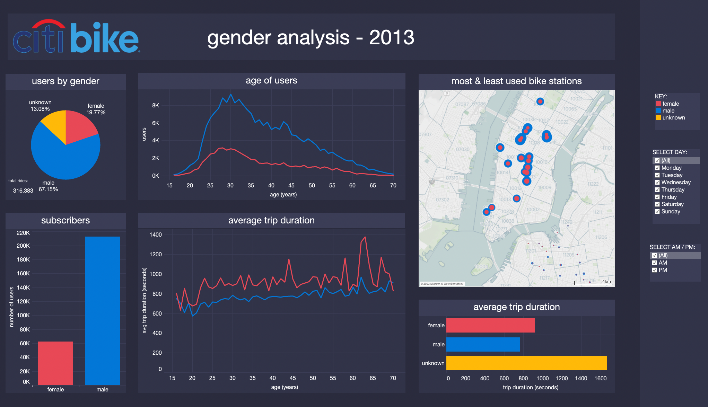
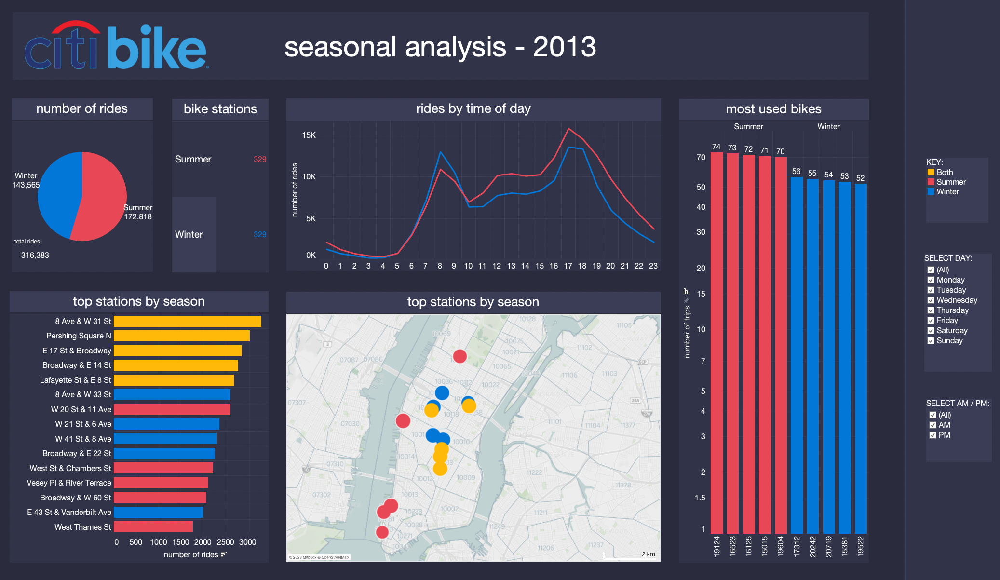
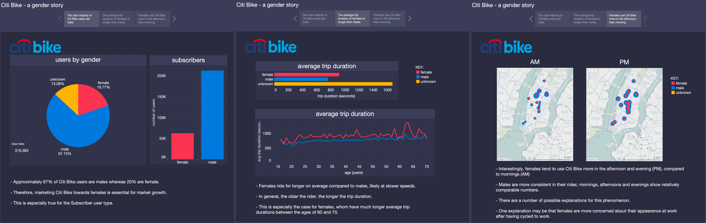

# Tableau Challenge

Analyses and Visualises New York City Citi Bike data fom 2013 using Tableau!

Created and submitted for an assignment for Monash University Data Analytics Boot Camp (October 2023).


## Table of Contents

- [General info](#general-info)
- [Analysis](#analysis)
- [Technologies](#technologies)
- [Screenshot](#screenshot)
- [Code example](#code-example)
- [References](#references)

## General info

### citibike_data_cleaning.ipynb

- Imports Citi Bike CSV files as Pandas DataFrames.
- Merges DataFrames into one complete DataFrame.
- Creates Age column and drops unwanted Columns.
- Extracts one week from Summer and one week from Winter for analysis:
- Exports tableau_citibikes.csv for Tableau import.

### Module 18 Challenge - Tableau Citi Bike.twbx

- Tableau workbook containing approximately twenty Sheets, two interactive Dashboards and one Story ([Link to Tableau Workbook](https://public.tableau.com/views/Module18Challenge-TableauCitiBike/Dashboard-Gender?:language=en-US&:display_count=n&:origin=viz_share_link))

- Interactive Dashboard - Gender
  - Analyses Citi Bike trends based on Gender.
  - Displays the Most and Least popular Bike Stations to reduce visual clutter on Map.
  - Contains Filters for Day(s) of the Week, and Time of Day (AM/PM).
  
- Interactive Dashboard - Seasonal
  - Analyses Citi Bike trends based on Summer and Winter.
  - Displays only the Most Popular Bike Stations by Season to reduce visual clutter on Map.
  - Contains Filters for Day(s) of the Week, and Time of Day (AM/PM).
  
- Story - Gender
  - Three-tab story board of gender-specific phenomena discovered from the data.


### Resources Folder

- Contains: 
  - Cleaned and merged data from two weeks in CSV file format.
  - Various screenshots of the Dashboard and Story.

## Analysis

### Interactive Dashboard - Gender Analysis



- Approximately 67% of Citi Bike users are male, whereas 20% are female. 
  - This suggests that marketing Citi Bike towards females could yield increased market growth and profit. 
  - This is especially true for the Subscriber user type.
- Approximately 13% of users either chose not to reveal their gender or are short-term users, in which case gender data is not collected.
- The average age of both male and female riders is approximately 37 years.
- Interestingly, females have slightly longer trip durations than males, suggesting that they might ride at slower speeds.
- In general, the older the rider, the longer the trip duration. 
  - This is especially the case for females, where it was found that female riders in their 50’s and 60’s have longer trip durations than those that are younger.
- During weekdays (Monday-Friday), there are slightly less Customers or short term users of Citi Bike, suggesting that short term users are perhaps tourists or NYC residents that travel or explore the city for leisure in their spare time.
- Further, the average trip duration for those of unknown gender (again, these are typically short-term users who do not provide this information), is significantly longer than those of known gender (typically Subscribers).
- On Weekends (Saturday & Sunday), the average trip duration for both males and females increases, especially in the case of females.
  - This suggests that riders on the weekend are more likely to be engaging in leisurely activities, rather than riding to work, which is likely to be more direct than scenic.
- However, overall there are more riders in the city on Weekdays than the Weekend (specifically Monday and Tuesday compared to Saturday and Sunday).
- Therefore, advertising Citi Bike as a fun weekend leisurely activity may be a viable method to enhance market growth and overall profit.
- Females tend to use Citi Bike more in the afternoon and evening (PM), compared to mornings (AM). Whereas males are more consistent in their rides - morning, afternoon and evenings show relatively comparable user numbers.

### Interactive Dashboard - Seasonal Analysis



- In general, and to no surprise, there are more users of Citi Bike overall during Summer than Winter.
- In light of this, more bike maintenance should be carried out on bikes used most often. These bikes will likely be found around the more popular bike station of the given season.
  - For instance, Bike: #19124 was used 74 times in just one week during Summer.
- In Summer, more riders choose to ride starting from 10:30am until midnight compared to Winter. However, there are slightly more riders during Winter at approximately 8am, likely representing the morning commute to work.
- Bike stations that line the Hudson and East Rivers are more popular during Summer than Winter, while more central stations are popular during Winter, which might correspond to seasonal attractions such as ice rinks, shopping centres or Christmas destinations.
- During weekends (Saturday & Sunday):
  - There are more than double the number of riders in Summer compared to Winter.
  - There are also far more riders late at night.
  - But on average, there are far fewer riders in the morning hours, during both Summer and Winter compared to weekdays.
- During weekdays (Monday-Friday):
  - Less people visit the popular Summer stations, likely due to the normal working week.
  - Interestingly, there are slightly more riders in Winter than Summer (especially during morning hours), likely because of less recreational rides and more work commutes.
- These data visualisations provide insights into where to focus Bike Station and general bike maintenance during Summer and Winter, and also show how the busiest Citi Bike hours shift with the seasons.

## Technologies

Project created and run using:

- Tableau Public 2023.2.2
- Visual Studio Code 1.82.0
- Python 3.10.9
  - Pandas 1.5.3


## Screenshot

#### Gender Story



## Code example

```python
## Code Snippet from citibike_data_cleaning.ipynb
#################################################

# Extract One Week from Winter

# Start and End dates for Winter
start_date = '2013-12-02'
end_date = '2013-12-09'

# Filter for Winter Week
winter_df = complete_df[(complete_df['startdate'] >= start_date) & (complete_df['startdate'] <= end_date)]

# Join Summer and Winter DFs together
tableau_df = pd.concat([summer_df, winter_df])

# Drop startdate Column
tableau_df = tableau_df.drop('startdate', axis=1)

# Check tableau_df
tableau_df
```

## References

- [Link to Tableau Workbook](https://public.tableau.com/views/Module18Challenge-TableauCitiBike/Dashboard-Gender?:language=en-US&:display_count=n&:origin=viz_share_link)
- Code, in general, was adapted from Monash University Data Analytics Boot Camp 2023 course learning material.

Created and written by Samuel Palframan - October 2023.
